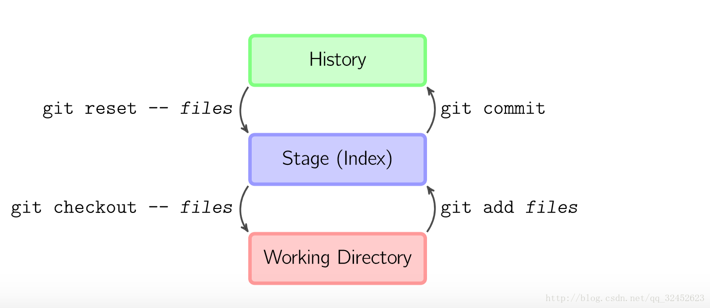

# git 的一些基本操作方法

## 本地操作

### git 基本提交

```js
  git add . //添加到暂存区
  git commit -m '提交说明'  //提交本地仓库
  git reset '文件名' //将暂存区的这个文件恢复到工作区
  git checkout '文件名'  //取消暂存区中这个文件的修改,恢复到修改之前
  git log //查看日志
  git log --oneline //简洁日志输出
  git reset --hard '版本号' //回退到某个版本
  git reflog // 查看所有版本号
  git diff //比较工作区 和 暂存区
  git checkout - b '分支名称' //创建并切换分支
  git merge '分支名称' //将其他分支内容合并到当前分支(要在master分支上进行合并分支)
```

### git 实用方法

> 场景: 如果在一个分支中修改了一些内容,但是需要切到另一个分支中查看其它或修改其它. 你不想提交这个版本,但是也不想放弃更改

```js
  //1.存入临时暂存区
  git add .
  git stash

  //取出来的时候用
  git stash pop
```



## 提交远程仓库的操作

### 如果没有配置秘钥

```js
  //查看全局用户名 , 查看全局邮箱
  git config --global user.name
  git config --global user.email

  //设置全局用户名和邮箱
  git config --global user.name '用户名'
  git config --global user.email '邮箱'

  ssh-keygen -t rsa -C '邮箱'
  /*
    1.会生成一个 id _rsa.pub
    2.找到文件 `C:\\Users\\用户文件夹\\.ssh\\id _rsa.pub`
    3.复制文件内容,放入 github -> settings -> SSH and GPG keys -> new SSH key (title可以随便起, key值粘贴id_rsa.pub里的内容就可以了)
  */
```
