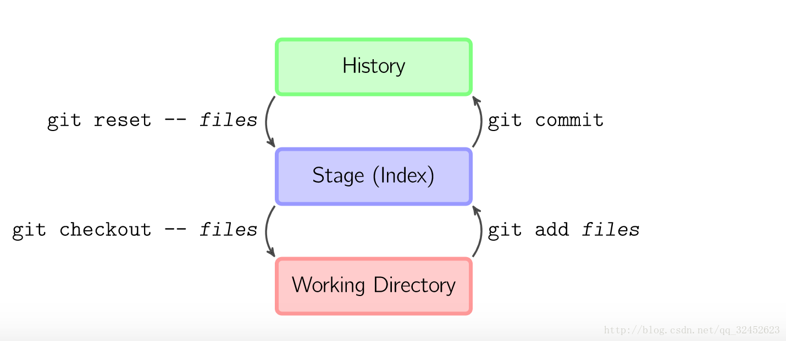

# git 的一些基本操作方法

## 本地操作

### git 基本提交

```js
  git add . //添加到暂存区
  git commit -m '提交说明'  //提交本地仓库
  git reset '文件名' //将暂存区的这个文件恢复到工作区
  git checkout '文件名'  //取消暂存区中这个文件的修改,恢复到修改之前
  git checkout - b '分支名称' //创建并切换分支
  git branch //查看分支
  git branch '分支名' //创建分支
  git branch -d //删除分支
  git branch -v //查看所有分支的当前处在的版本
  git branch -a //查看所有分支
  git log //查看日志
  git log --oneline //简洁日志输出
  git reset --hard '版本号' //回退到某个版本
  git reflog // 查看所有版本号
  git diff //比较工作区 和 暂存区
  git merge '分支名称' //将其他分支内容合并到当前分支(要在父分支上进行合并分支)
```

### 保存暂存区

> 场景: 如果在一个分支中修改了一些内容,但是需要切到另一个分支中查看其它或修改其它. 你不想提交这个版本,但是也不想放弃更改

```js
  //1.存入临时暂存区
  git add .
  git stash

  //取出来的时候用
  git stash pop
```
### 修改commit信息

>场景: 如果你不小心提交了commit信息,想重新编辑

```js
  // 修改最近一次的记录
  git commit --amend
  // 然后进入编辑面板 1.esc 进入vi编辑模式 ,重新编写之后按下esc 退出编辑模式 shift + ; , wq 保存并退出 w 保存, q退出

```
### 变基
> rebase 命令将提交到某一分支上的所有修改都移至另一分支上，就好像“重新 播放”一样。翻译成通俗的话： 找到参照的仓库和当前的仓库的相同的提交，然后把当前分支后续的提交挪动到参照仓库的提交的最后，形成一条线性的提交顺序。
```js
  git checkout 'a分支' 
  git rebase 'rebase分支' 
  // 将 rebase分支上的所有修改都移动到a分支上
```



## 提交远程仓库的操作

### 如果没有配置秘钥

```js
  git config --list //查看配置信息

  //查看全局用户名 , 查看全局邮箱
  git config --global user.name
  git config --global user.email

  //设置全局用户名和邮箱
  git config --global user.name '用户名'
  git config --global user.email '邮箱'

  git config --global core.ignorecase false  //全局设置不要忽略大小写,我用的没有效果
  git config core.ignorecase false  //设置不要忽略大小写, 亲测有效 ^-^

  /*
    在没有设置忽略大小的情况下,可以使用
      git mv <old_name> <new_name>
    来让git捕获到文件名的修改
      git restore --staged <file>
    我的理解是确认?
    然后就可以 添加暂存 提交本地仓库了
  */

  ssh-keygen -t rsa -C '邮箱'
  /*
    1.会生成一个 id _rsa.pub
    2.找到文件 `C:\\Users\\用户文件夹\\.ssh\\id _rsa.pub`
    3.复制文件内容,放入 github -> settings -> SSH and GPG keys -> new SSH key (title可以随便起, key值粘贴id_rsa.pub里的内容就可以了)
  */
```

### 基础操作

```js
  git clone 远程仓库地址 '项目名<可选>' //将代码克隆到远程仓库
  git remote //查看远程仓库地址
  git remote add '仓库别名' '远程仓库地址' //添加远程仓库
  git remote remove '仓库别名' //删除这个远程仓库

  git fetch <remote> HEAD //拉下来指定分支

  git pull //拉下来默认分支
  git push //将默认分支推上远程分支

  git pull <remote> HEAD //拉下来指定分支
  git push <remote> HEAD //推上去指定分支

  git push <remote> --delete HEAD 删除当前远程分支
```

#### fetch 与 pull 的区别

> pull 根据不同的配置，可等于 fetch + merge 或 fetch + rebase

**工作区(working directory)** `简言之就是你工作的区域。对于git而言，就是的本地工作目录。工作区的内容会包含提交到暂存区和版本库(当前提交点)的内容，同时也包含自己的修改内容。`

**暂存区(stage area, 又称为索引区index)** `是git中一个非常重要的概念。是我们把修改提交版本库前的一个过渡阶段。查看GIT自带帮助手册的时候，通常以index来表示暂存区。在工作目录下有一个.git的目录，里面有个index文件，存储着关于暂存区的内容。git add命令将工作区内容添加到暂存区。`

**本地仓库(local repository)** `版本控制系统的仓库，存在于本地。当执行git commit命令后，会将暂存区内容提交到仓库之中。在工作区下面有.git的目录，这个目录下的内容不属于工作区，里面便是仓库的数据信息，暂存区相关内容也在其中。这里也可以使用merge或rebase将远程仓库副本合并到本地仓库。图中的只有merge，注意这里也可以使用rebase。远程版本库(remote repository)，与本地仓库概念基本一致，不同之处在于一个存在远程，可用于远程协作，一个却是存在于本地。通过push/pull可实现本地与远程的交互；`

**远程仓库副本** `可以理解为存在于本地的远程仓库缓存。如需更新，可通过git fetch/pull命令获取远程仓库内容。使用fech获取时，并未合并到本地仓库，此时可使用git merge实现远程仓库副本与本地仓库的合并。git pull 根据配置的不同，可为git fetch + git merge 或 git fetch + git rebase。rebase和merge的区别可以自己去网上找些资料了解下。`


